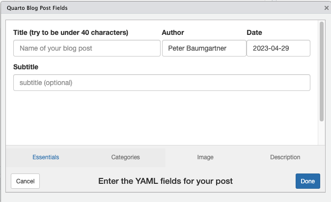

```{r, include = FALSE}
knitr::opts_chunk$set(
  collapse = TRUE,
  comment = "#>",
  fig.path = "man/figures/README-",
  out.width = "50%"
)
```

# quartopost

<!-- badges: start -->

[](https://github.com/petzi53/quartopost/actions/workflows/R-CMD-check.yaml)

<!-- badges: end -->

## Goal

The goal of `quartopost` is to create and open a Quarto blog post in
RStudio.

`quartopost()` displays a dialog window where you can enter the data for
the YAML header of a new blog post.

```{r screenshot, fig.align='center', echo=FALSE, fig.cap='Dialog window for creating a blog post', fig.alt='Dialog windows shows input field for title, author, date and subtitle'}

```

After clicking the "Done" button the function generates the core
skeleton of a Quarto post. This includes:

-   creating the directory (named with the date and title in kebab
    notation)
-   (optionally) copying images from your hard disk into this new folder
-   creating the `index.qmd` file with the YAML header populated from
    the data of the dialog window
-   opening the blog post file in RStudio for editing.

You can choose from your categories already created or add new
categories. With the package comes also an RStudio Addin so you can bind
the `quartopost()` with a shortcut.

## Installation

You can install the development version of `quartopost` from
[GitHub](https://github.com/) with:

```{r installation, eval=FALSE}
# install.packages("devtools")
devtools::install_github("petzi53/quartopost")
```

## Example

```{r example}
library(quartopost)

if (interactive()) 
    quartopost()
```

## Possible Configurations

To create Quarto posts even easier, you can configure `quartopost` in
three ways:

### Provide a shortcut

- Choose "Tools -\> Modify Keyboard Shortcuts ..." from the RStudio menu.
- Filter the search box for "quarto". 
- Click into the column "Shortcut" of the "Create Quarto Post" addin. 
- Provide your keyboard shortcut.

### Add author name programmatically

If you are the only blog author on your machine, you can add your name
to the author field automatically.

- Install the `usethis` package. Open `.Rprofile` with
`usethis::edit_r_profile()`.
After adding the following line into `.Rprofile` restart RStudio

```
options(servr.daemon = TRUE,
    quartopost.author = "<your name>" 
)
```


### Prevent confirmation question

If you want to prevent the confirmation question before `quartopost()`
creates the folder with the post (and copies your chosen image), add
another line into `.Rprofile`:

```
options(servr.daemon = TRUE,
    quartopost.verbose = FALSE 
)
```

If you are going to add both lines to .`RProfile`, then you need to add
a comma to the first line., e.g.:

```
options(servr.daemon = TRUE,
    quartopost.author = "Peter Baumgartner",
    quartopost.verbose = FALSE 
)
```
Do not forget to restart RStudio!
