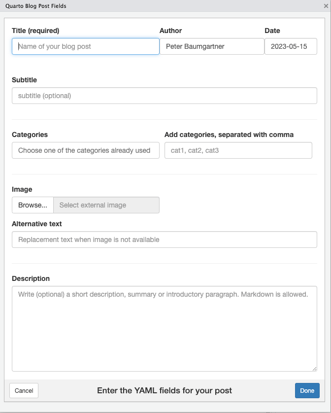

# quartopost

<!-- badges: start -->

[](https://github.com/petzi53/quartopost/actions/workflows/R-CMD-check.yaml)

<!-- badges: end -->

## Goal

To use this package you need to work in RStudio. The goal of
`quartopost` is to create and open a Quarto blog post with the
appropriate YAML front matter in RStudio.

`quartopost()` displays a dialog window where you can enter the data for
the YAML header of a new blog post.

<div class="figure" style="text-align: center">


<p class="caption">
Dialog window for creating a blog post
</p>

</div>

After clicking the “Done” button the function generates the core
skeleton of a Quarto post. This includes:

- creating the directory (named with the date and title in kebab
  notation)
- (optionally) copying images from your hard disk into the new created
  folder
- creating the `index.qmd` file with the YAML header populated from the
  data of the dialog window
- opening the blog post file in RStudio for editing.

You can choose from your categories already created or add new
categories. With the package comes also an RStudio Addin so you can bind
the `quartopost()` command with a shortcut.

## Installation

You can install the development version of `quartopost` from
[GitHub](https://github.com/) with:

``` r
# install.packages("devtools")
devtools::install_github("petzi53/quartopost")
```

## Example

``` r
library(quartopost)

if (interactive()) {
  quartopost()
}
```

## Possible Configurations

To create Quarto posts even easier, you can configure `quartopost`:

### Provide a shortcut

- Choose “Tools -\> Modify Keyboard Shortcuts …” from the RStudio menu.
- Filter the search box for “quarto”.
- Click into the column “Shortcut” of the “Create Quarto Post” addin.
- Provide your keyboard shortcut.

### Add author name programmatically

If you are the only blog author on your machine, you can add your name
to the author field automatically.

- Open `.Rprofile`. The easiest way it to install `usethis`\` and open
  `.Rprofile` with `usethis::edit_r_profile()`.
- Add the following line into `.Rprofile`

<!-- -->

    options(servr.daemon = TRUE,
        quartopost.author = "<your name>" 
    )

- Restart RStudio.

### Prevent confirmation question and verbose output

If you want to prevent the confirmation question before `quartopost()`
creates the folder with the post, the YAML header and (optionally)
copies your chosen image, add another line into `.Rprofile`:

    quartopost.verbose = FALSE 

### Define the draft status of the created file

You can specify if you want the new post with `draft: true` (Standard)
or `draft: false`.

### Summary

If you are going to add all lines to .`RProfile`, then your code
snippets should look like:

    options(servr.daemon = TRUE,
        quartopost.author = "Peter Baumgartner", # default = ""
        quartopost.verbose = FALSE,              # default = TRUE
        quartopost.draft = FALSE                 # default = TRUE
    )

Do not forget to restart RStudio after you changed `.Rprofile`!

## Acknowledgements

I am not very experienced in R programming, so I am very grateful that I
could take help and suggestions from different sources:

I started with `quartopost()` after a question or feature request at
the [Posit
forum](https://community.rstudio.com/t/template-or-addin-for-new-posts-in-quarto-blog/164735/2).
I got some helpful links that I tried out and used as precursors for my
implementation.

I took the [new_post() script from The Mockup
blog](https://themockup.blog/posts/2022-11-08-use-r-to-generate-a-quarto-blogpost/) as
an advanced organizer for the general structure of my approach. It has a
very extensive and understandable explanation. I learned about the kebab
notation I had never heard about until this blog post. For German
umlauts – and special characters in other languages -, I added the line
`stringi::stri_trans_general((title), "latin-ascii")` (learned from
a [StackOverflow answer](https://stackoverflow.com/a/38171652/7322615)).

I also used some ideas from the [newpost
package](https://github.com/smach/newpost/), particularly the use of
RStudio Addins and the request that users choose from categories already
used.

My knowledge of R programming is limited, but I am a complete newbie
when it comes to Shiny apps. (I just started reading the fantastic
[Mastering Shiny book by Hadley Wickham](https://mastering-shiny.org/).)
I took the general structure of the Shiny window from the blogdown “New
Post” RStudio addin by Yihui Xie. The lack of a similar function for
Quarto was generally my main incentive to start with the quartopost
project in the first place.

I don’t want to release my package to CRAN, but I tried to follow the
advises of [R Packages](https://r-pkgs.org/).

## Contribution is welcome!

I am sure that my code is not efficient and that there are many ways to
improve my package. I am very interested to learn better programming in
R / Shiny / (JavaScript). If you find bugs or more efficient ways to
solve my intended goal please do not hesitate to raise an issue or
provide a pull request.
